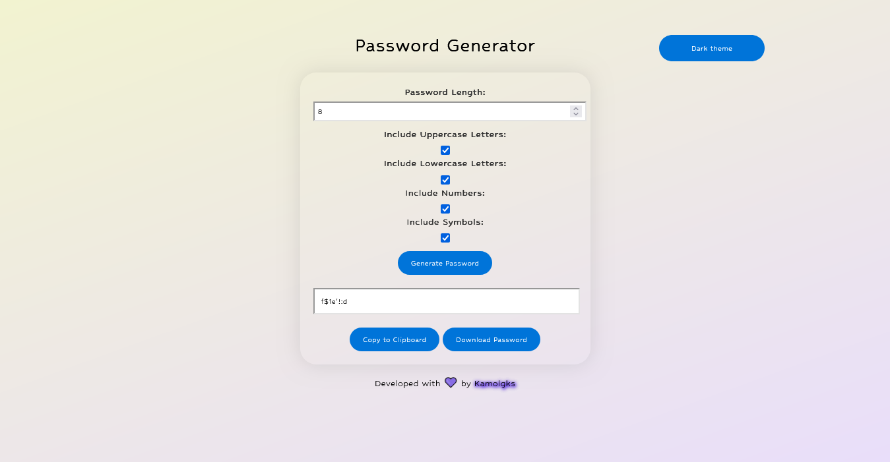
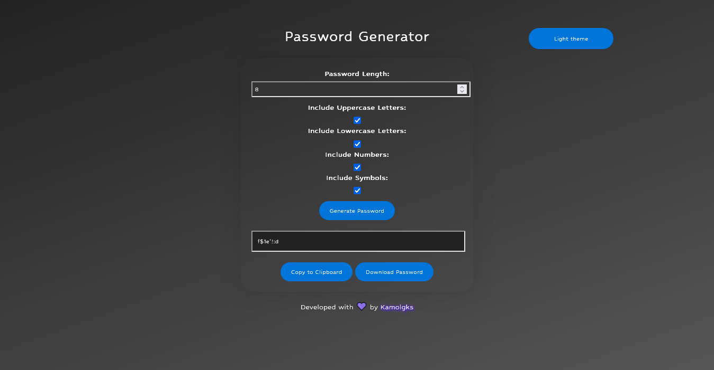
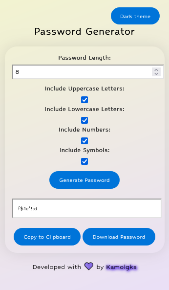
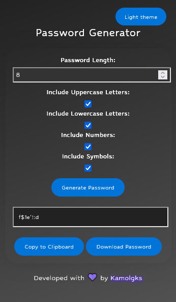

# Screenshots (Desktop):

---

<!-- # Screenshots (Mobile):

--> 

# Screenshots (Mobile version): 

  
  

Launch

Clone the repository:

<pre lang="bash">git clone https://github.com/Kamolgks/Password-Generator</pre>
  
Then install requirements:

<pre lang="bash">pip install -r requirements.txt</pre>

Then run the file:

<pre lang="bash">python3 app.py</pre>

---

**
Requirements
**

- Python3 (version 3.8 or later)
- Flask

---

## License

This project is licensed under the [GNU GENERAL PUBLIC LICENSE](LICENSE).
